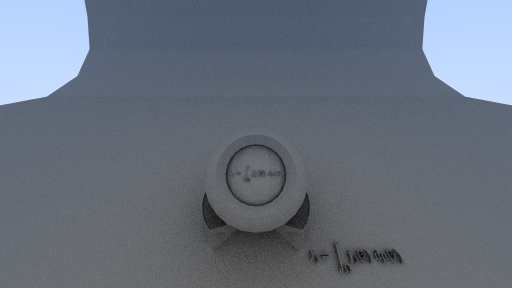
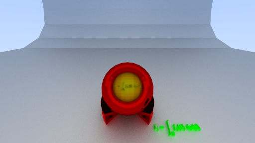
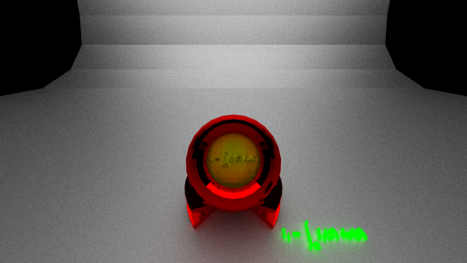
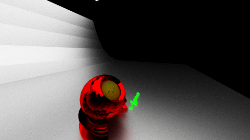
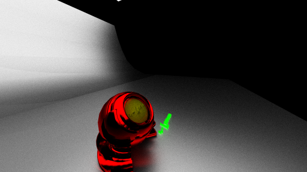
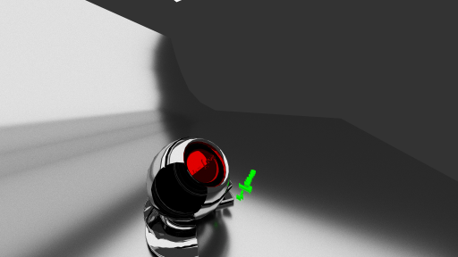

# lumina: ray tracing project

# Introduction
luminaはC++で書かれたレイトレーシングを主目的としたテストプロジェクトです。
今後はBSDFを用いた材質表現や、フォトンマッピングの実装を目標としています。
またレイトレーシングに限らず、物理シミュレーションやゲームエンジンのような機能も実装できればと考えています。

# Installation
現時点では純粋なC++で書かれているため、追加のライブラリは必要ありません。
ビルドには[CMake](https://cmake.org/)を使用します。
プロジェクトのルートフォルダに`build`フォルダを作成し、`build`フォルダ内で
```bash
cmake ..
cmake --build . --config debug (Debugビルドの場合)
cmake --build . --config release (Releaseビルドの場合)
```
を実行します。
また、現時点ではテストシーンに[Mori knob](https://casual-effects.com/g3d/data10/index.html#mesh23)を使用しているため、ダウンロードして、`./asset/`フォルダ直下に配置します。
Mori knobは`Material`としてグループ化されている光源用に天井に配置されている四角形を拡大して使用しています。
```diff
# line 16203 to 16206
- v 3.750000 12.017239 -3.748953
- v -3.750000 12.194347 3.748953
- v -3.750000 12.017239 -3.748953
- v 3.750000 12.194347 3.748953
+ v 13.750000 12.017239 -13.748953
+ v -13.750000 12.194347 13.748953
+ v -13.750000 12.017239 -13.748953
+ v 13.750000 12.194347 13.748953
```

# Result
DebugビルドとReleaseビルドでは実行時間に大きな差があるため、ビルドに応じてレイトレーシングの設定を変更しています。
Releaseビルドしたアプリケーションを実行するとレイトレーシングを実行し、以下のような画像を生成します。





128spp, 最大再帰深度32





1024spp, 最大再帰深度32, 生成時間17分, マテリアル情報を設定





1024spp, 最大再帰深度32, 光源メッシュのみでライティング





別視点





法線補間を使用





4096spp, ロシアンルーレットを使用


# Features
- マルチスレッドを使用したレイトレーシング
現時点での実装では画像を領域ごとに分割してそれぞれをマルチスレッドで処理するようにしています。
- BVH(Bounding Volume Hierarchy)を用いた計算量効率化
メッシュデータに対してBVHを構築することで交差判定の回数を削減し、効率的に計算を行うようにしています。

# ToDo
- [ ] BVHの構築方法をSAH(Surface Area Heuristic)を用いたものに変更し、BVHの品質を向上させる。
- [x] メッシュに対してマテリアル情報を付加し、BSDFによってレイの反射方向を制御する。
Wavefront OBJの`g`タグを利用する。
鏡面反射に関してはラフネスによって制御する方式で実装。
完全鏡面反射(ラフネスを~~非常に小さい値にする。0にはできない~~0にする)に関しては生成画像が不安定になるので要検証。
- [ ] 屈折を屈折率(refractive index)で実装する。
- [x] マルチスレッドの実装方法の変更。
領域分割ではなくレイに対してのタスクキュー方式にして、性能の変化を調べる。
128ppxでの検証:
  - 領域分割での実装: 118s
  - タスクキューでの実装: 77s
- [ ] GPUを用いた並列計算の実装。
Vulkanのコンピュートシェーダを使う予定。
- [ ] デバッグログや時間計測などのユーティリティの規格化と実装。
- [x] `.obj`ファイルから読み込む情報の拡大。
テクスチャ座標(`vt`)、法線(`vn`)とそれぞれのインデックス。
- [x] `.obj`ファイルの法線データを使って補間した法線を使う。
三角形の重心座標から各頂点に割り振られた法線ベクトルをミックスする。
- [x] メッシュのデータ構造を明確にする。
頂点、テクスチャ座標、法線とそれぞれのインデックス、グループ情報、重心座標計算用の内積を格納する。
事前計算に関してはデータサイズを考慮する。
# ToStudy
- [ ] パストレーシングの仕組みを詳しく理解する。
[Raytracing in One Weekend](https://raytracing.github.io/)を参考に。再帰とアルベドの関係、BSDFやPDFについて。
BSDFを実際の計算に使うことがあるのか？PDFは光源から直接サンプリングするときに重要になる。
- [ ] マイクロファセット理論の理解。
BSDFやPDFの計算への影響。
